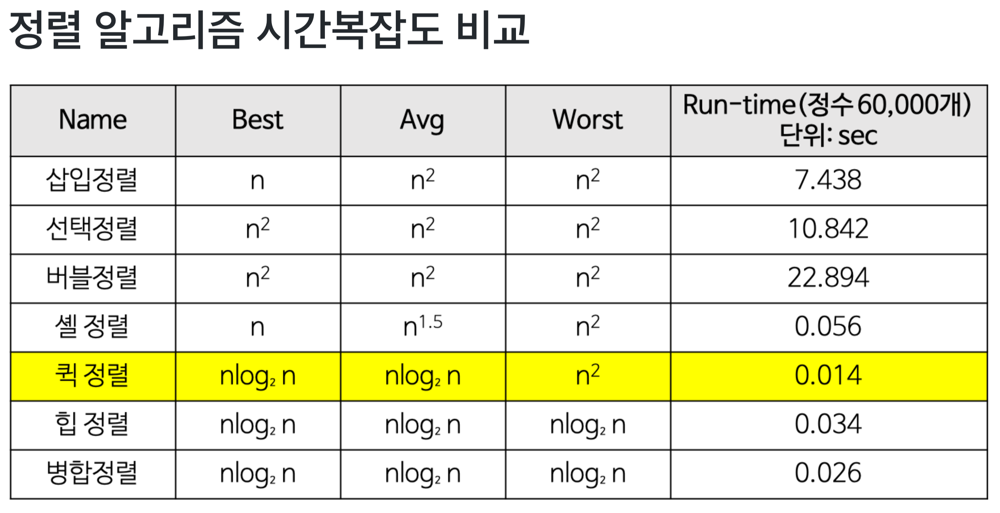

# 정렬

공부를 해 보았는데, Quick 과 Tim sort 가 짱이다.<br>
2개만 제대로 외워두자.

- Tim Sort
  - 자바와 파이썬의 기본 정렬 알고리즘
  - [Naver D2](https://d2.naver.com/helloworld/0315536)
  - [Geeks for Geeks](https://www.geeksforgeeks.org/timsort/)

## Command

```sh
// 자바 컴파일
javac -Xlint -d ./sort/classes ./sort/*.java

// 컴파일된 class 실행
java -cp ./sort/classes sort.Main

// 컴파일된 class 삭제
rm -rf ./sort/classes
```

## Compare

| Name            |   Best   | Average  |  Worst   | Memory |   Stable |
| --------------- | :------: | :------: | :------: | -----: | -------: |
| Quick(퀵)       |   `n`    | `n lg n` |  `n^2`   | `lg n` | unstable |
| Tim(팀)         |   `n`    | `n lg n` | `n lg n` |    `n` |   stable |
| Merge(병합)     | `n lg n` | `n lg n` | `n lg n` |    `n` |   stable |
| Bubble(거품)    |   `n`    |  `n^2`   |  `n^2`   |    `1` |   stable |
| Insertion(삽입) |   `n`    |  `n^2`   |  `n^2`   |    `1` |   stable |
| Selection(선택) |  `n^2`   |  `n^2`   |  `n^2`   |    `1` |   stable |


